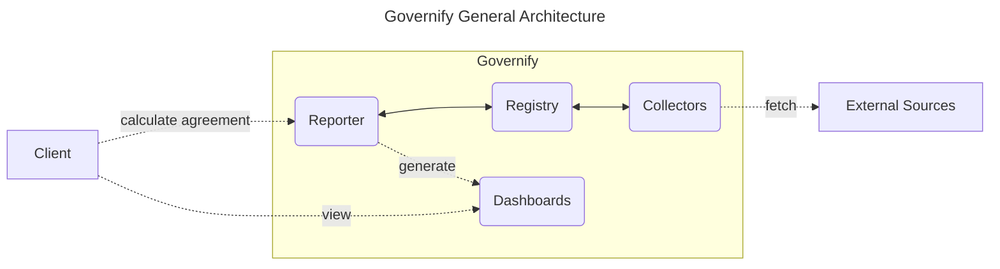
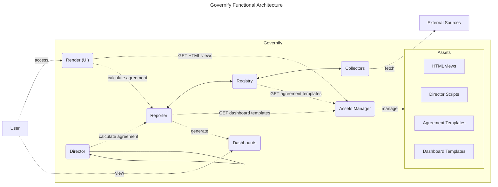

# Architecture

---

As explained in previous sections, Governify could be understood as a platform that provides a set of services to manage the governance in different scenarios. In this section, the general architecture is presented, along with the main components and their interactions.

## General architecture

In general terms, Governify at its core is composed of three main components: Registry, Reporter and Collectors. These three components interact with each other to calculate the agreement metrics and guarantees based on the data provided by the Collectors. The Reporter is also in charge of generating the dashboards that are used to visualize the agreement metrics and guarantees. The following diagram summarizes these interactions.



## Services

Appart from the main components, Governify needs some additional services that endow the system with a high configurability and scalability. This way, Governify is able to be adapted to multiple scenarios as stated in the use cases. To do so, the infrastructures under Governify environment rely on static assets (agreement templates, interface views, dashboard templates...) that are injected in the system at runtime. 

To manage this configurability, Governify provides a set of services that are in charge of managing these assets and correctly register them in the system. The following diagram shows the main services that Governify provides.



Depending on the specific infrastructure, new services may be included to manage scopes, like the [Scope Manager](/development/services/scopes-manager.md) for [Bluejay Infrastructure](https://docs.bluejay.governify.io), or to gather data from different sources such as other systems, which is the case of Prometheus in [Falcon Infrastructure](https://docs.falcon.governify.io).

### Service Discovery & Registry

By design, Governify relies on a [Common Library](/development/tooling/commons-library.md) which has its particular implementation of the [Service Registry Pattern](https://microservices.io/patterns/service-registry.html) to provide a [server-side service discovery mechanism](https://microservices.io/patterns/server-side-discovery.html). This way, Governify services are able to register themselves in the system and be discovered by other services. To do so, every Service integrate the commons library which will request the [infrastructure file](http://localhost:3000/development/services/assets-manager#infrastructureyaml) upon startup, so each service knows where the rest of services within the infrastructure are located.

```mermaid
---
title: Governify Services Startup Procedure
---
flowchart RL
    subgraph Service1[Governify Service A]
        commons1(Commons Library)
    end

    subgraph Service2[Governify Service B]
        commons2(Commons Library)
    end

    commons1-.request infrastructure file.->assets(Assets Manager)
    commons2-.request infrastructure file.->assets(Assets Manager)

    Service1-.discover infrastructure.Service2.->Service2
```

Note that this service resgitry pattern is not a [self-registration](https://microservices.io/patterns/self-registration.html) nor [third-party](https://microservices.io/patterns/3rd-party-registration.html) mechanism since the infrastructure file must be preconfigured by an administrator, meaning all services must be known beforehand. The [Assets Manager](/development/services/assets-manager.md) service could be considered the service registry in this context, since is the one in charge of managing and serving the infrastructure file, with the difference that the rest of services do not register themselves in the system, but they request the already preconfigured infrastructure file for service discovery.