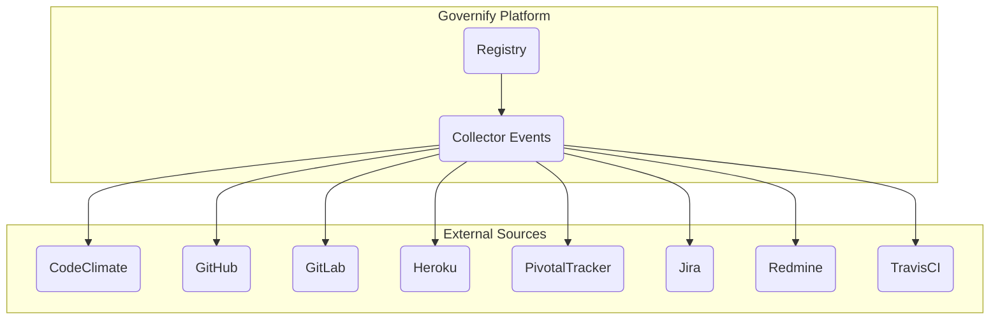
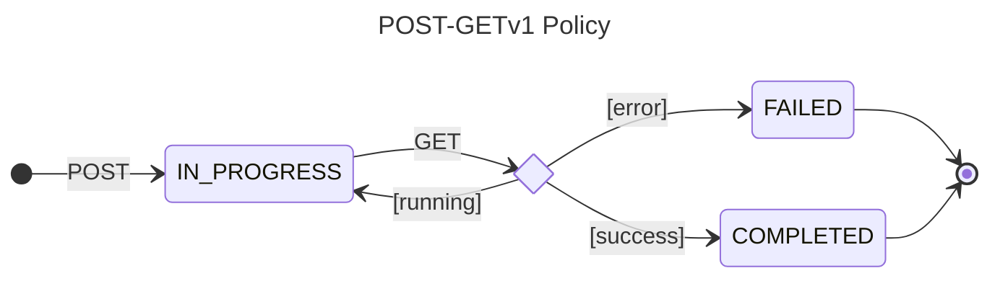

# Collector Events

---

## Overview

As mentioned in previous section, the Collector Events, like any other collector service, is in charge of gathering the required data to compute the metrics and guarantees defined in the SLAs. The Collector Events service is the one who actually compute the values and evidences for the guarantees, and then send them to the Registry service to be stored.



### Available sources
The Events Collector can fetch data from multiple sources' REST and GraphQL APIs. Currently, the available sources are:
- **CodeClimate:** Get the code review metrics for a repository from CodeClimate API.
- **GitHub REST API:** Collect events from GitHub (issues, pull requests, comments...) from GitHub REST API.
- **GitHub GraphQL API:** Collect GitHub events through its GraphQL API.
- **GitLab:** Gather GitLab events (issues, merge requests, comments...) from GitLab API.
- **Heroku:** Get information about Heroku releases and builds from Heroku API.
- **Pivotal Tracker:** Collect Pivotal Tracker events (stories, comments...) from Pivotal Tracker API.
- **Jira:** Gather Jira events (issues, comments...) from Jira API.
- **Redmine:** Get Redmine events (issues, comments...) from Redmine API.
- **Travis CI:** Collect Travis CI workflow events from Travis CI API.


### Metrics Library
You can check the available metrics in the [Metrics Library](https://github.com/governify/governify-examples/tree/master/metrics/event-collector) under the examples repository.
  
## API
As of any service within the Governify environment, the Events Collector service exposes an API to interact with it. This API is used by the Registry service to request the data needed to compute the metrics and guarantees.

### POST-GET Asyncronous API
Due to computations taking long time, the Events Collector API is asyncronous. This API uses a POST-GET policy. This policy implies that a POST request is made in the first place to start a computation, the API will respond with a computation Id which is then used to retrieve the results with a GET request. The following state diagram illustrates this behaviour:



### Endpoints
According to the POST-GET policy, the Events Collector API exposes two endpoints:

| Method | Endpoint | Description |
| ------ | -------- | ----------- |
| POST | `/api/v2/computations` | Starts a computation and returns a computation Id. |
| GET | `/api/v2/computations/{computationId}` | Retrieves the results of a computation. |

## Advanced

The file `./configurations/sourcesManager.json` cointains information about needed parameters for the collector needs for fetching API data. The structure is fairly simple:

The file is a JSON containing 3 objects:
- `endpoints`

  It stores the relation between and actual metric input and the endpoint of the API it connects to.
  This object contains as many objects inside as APIs the collector has integrated into it. Each object contains the relation between the data the metric needs to compute and the endpoint where the collector can find that data.
  ```javascript
  ./configurations/sourcesManager.json
  
  "endpoints": {
    "github": {
      "events": "/repos/{github.repoOwner}/{github.repository}/events"
    },
    "pivotal": {
      "activity": "/projects/{pivotal.project}/activity"
    },
    "heroku": {
      "releases": "/apps/{heroku.project}/releases"
    }
  }
  ```
  The endpoints can have integrations indicated between {}. Theese will be replaced with the actual project information to fetch the data.
- `substitutions`

  Some metrics, when looking for the match with the payload the APIs return, might need to look for the user of a repo for example. In this array it is possible to indicate the relation between an %STRING% string on a metric with an actual integration
  ```javascript
  ./configurations/sourcesManager.json
  
  "substitutions": [
    "GITHUB.REPO_OWNER->github.repoOwner"
  ]
  ```
  In this substitution any %GITHUB.REPO_OWNER% string inside a metric will be replaced with the github.repoOwner integration of the  project.
- `payloadDates`

  This configuration is changed whenever a new API is integrated in the system. Metrics have nothing to do with this as long as it is configured correctly on integration. It tells each API fetcher where can it find the timestamp of the event. For example:

  For this shortened pivotal activity payload:
  ```javascript
  ./configurations/sourcesManager.json
  
  {
    "kind": "story_update_activity",
    "guid": "2242320_415",
    "project_version": 415,
    "message": "César García Pascual started this feature",
    ...

    ...
    "performed_by": {
      "kind": "person",
      "id": 3296464,
      "name": "César García Pascual",
      "initials": "cgp"
    },
    "occurred_at": "2020-01-27T12:43:51Z"
  }
  ```
  The timestamp of this event is `2020-01-27T12:43:51Z` indicated on the field `occurred_at` at the end of the payload. So the sources manager configuration will look like this:

  ```javascript
  ./configurations/sourcesManager.json
  
  "payloadDates": {
    "pivotal": "occurred_at"
  }
  ```

### Collector Metric-Config Example
Having this simplified metric concerning the APIs sources:
 
```javascript
METRIC

"element": {
  "percentage": {
    "related": {
      "github": {
        "events": {
          "type": "PullRequestEvent",
          "payload": {
            "action": "closed",
            "pull_request": {
              "base": {
                "label": "%GITHUB.REPO_OWNER%:master"
              }
            }
          }
        }
      },
      "window": 86400
    }
  }
},
"event": {
  "pivotal": {
    "activity": {
      "highlight": "accepted"
    }
  }
}
```
 
The collector will fetch information from 2 sources. Looking at the GitHub request:
```javascript
METRIC

"github": {
  "events": {
    "type": "PullRequestEvent",
    "payload": {
      "action": "closed",
      "pull_request": {
        "base": {
          "label": "%GITHUB.REPO_OWNER%:master"
        }
      }
    }
  }
}
```
The system will fetch the events information. Going to the endpoints configuration:

```javascript
ENDPOINTS

"github": {
  "events": "/repos/{github.repoOwner}/{github.repository}/events"
}
```
The events information corresponds to the endpoint `/repos/{github.repoOwner}/{github.repository}/events`. The system will substitute `{github.repoOwner}` and `{github.repository}` with the information extracted from the Scope Manager for the project.

---

Looking at the most nested part of the metric we can see a % item:
```javascript
METRIC

"label": "%GITHUB.REPO_OWNER%:master"
```
Going to the substitutions configuration:
```javascript
SUBSTITUTIONS

"GITHUB.REPO_OWNER->github.repoOwner"
```

The system will replace %GITHUB.REPO_OWNER% with the information extracted from the Scope Manager for the project.

### GraphQL custom query

This method was created due to complexity of GraphQL nested objects. It is a custom method in which different steps are sequentially executed to fetch, transform and return data.

This is a metric for obtaining the number of assigned issues, in a column called "Doing" inside a GitHub project, for each member:
```json
{
    "metric": {
        "computing": "string",
        "element": "number",
        "event": {
            "githubGQL": {
                "custom": {
                    "type": "graphQL",
                    "steps": {
                        "0": {
                            "type": "queryGetObject",
                            "query":  "{repository(name: \"%PROJECT.github.repository%\", owner: \"%PROJECT.github.repoOwner%\") {projects(first: 1) {nodes {name,columns(first: 10) {nodes {name,cards(first: 100) {totalCount,nodes {column {name},content {... on Issue {url,number,title,createdAt,updatedAt,assignees(first: 10) {nodes {login}}}}}}}}}}}}"                            
                        },
                        "1": {
                            "type": "objectGetSubObjects",
                            "location": "data.repository.projects.nodes.0.columns.nodes"
                        },
                        "2": {
                            "type": "objectsFilterObject",
                            "filters": [
                                "name == 'Doing'"
                            ],
                            "keep": "first"
                        },
                        "3": {
                            "type": "objectGetSubObjects",
                            "location": "cards.nodes"
                        },
                        "4": {
                            "type": "objectsFilterObjects",
                            "filters": [
                                "content.assignees.nodes.*any*.login == '%MEMBER.github.username%'"
                            ]
                        }
                    }
                }
            }
        },
        "scope": {
            "project": "testing-GH-governifyauditor_testing-goldenflow",
            "class": "testing",
            "member": "*"
        },
        "window": {
            "initial": "2021-01-20T00:00:00Z",
            "period": "annually",
            "type": "static",
            "end": "2021-02-19T00:00:00Z"
        }
    },
    "config": {
        "scopeManager": "SCOPEURL"
    }
}
```

As it can be seen, it is composed of 5 different steps. These steps are highly configurable and easy to add new steps.

### Steps

The different are given inside the steps key inside the custom object. Each step has to be inside a numbered object as they will be performed in an increasing order.

The steps are differenciated by its type. These steps types follow a simple pattern for better steps concatenation. 
 - Their types can start with "object", "objects" or nothing refering if they expect a single object, an array of objects or nothing at the execution. 
 - Their types have to end with "object" or "objects", refering if after the execution, a single object or an array of objects is left.

#### Step type: queryGetObject and queryGetObjects
This steps expect nothing and returns or an object or an array of objects. They do the same but both types are correct for better reading of the DSL.

```json
{
  "type": "queryGetObject",
  "query":  "{repository(name: \"%PROJECT.github.repository%\", owner: \"%PROJECT.github.repoOwner%\") {projects(first: 1) {nodes {name,columns(first: 10) {nodes {name,cards(first: 100) {totalCount,nodes {column {name},content {... on Issue {url,number,title,createdAt,updatedAt,assignees(first: 10) {nodes {login}}}}}}}}}}}}"                            
}
```

It needs a "query" parametter to be passed containing the graphQL query stringified and using comas between keys at the same level. There is a simple .js to transform graphQL queries into the string format in utils/queryToString.js to simplify the process. 
%PROJECT.github.repository% and %PROJECT.github.repoOwner% are used to insert the scopes identities inside the query and make it generic for all the different teams.

#### Step type: objectGetSubObject and objectGetSubObjects
This steps expect a single object and return an object or an array of objects. They do the same but both types are correct for better reading of the DSL.
```json
{
  "type": "objectGetSubObjects",
  "location": "data.repository.projects.nodes.0.columns.nodes"
}
```

It obtains the object/s inside an object. The object/s location is specified as if it was navegated through javascript.

#### Step type: objectsFilterObject and objectsFilterObjects
This steps expect an array of zero or more objects and return an object or an array of objects.

A filters array with one or more strings is requried. These strings are equations. The left part contains the attribute location on the different objects to compare and the right part the value the obtained attribute is expected to be.

If the filter is *objectsFilterObject*, a parameter "keep" is expected as many objects can be retrieved from the filter and only one can remain. *first, last, min, max, sum, avg* are the valid options.
```json
{
  "type": "objectsFilterObject",
  "filters": [
    "name == 'Doing'"
  ],
  "keep": "first"
}
```

If the filter is *objectsFilterObjects*, the keep parameter is no longer needed.
```json
{
  "type": "objectsFilterObjects",
  "filters": [
    "content.assignees.nodes.*any*.login == '%MEMBER.github.username%'"
  ]
}
```

Here, information about the members can be included to compare for example, the content of an object key to be the username of a github username, as it can be seen in the example.

#### Step type: runScript
This step expects anything and is passed in to a function exported as generic. It's expected to return a response in the form of an object/array or another kind in case it is compatible with the metric.

To this date it can receive two parametters:
- `script`: It is a function exported as generic and receives two inputs: the data being filtered/obtained from the steps executed before it and an object containing variables to generalize the script and modify different filters/conditions inside the script. It must return the processed data in order to move to the next pipeline or to be returned. This script has to be [scaped](https://www.freeformatter.com/json-escape.html#ad-output) in order to fit in the TPA as a JSON.
- `variables`: This is the object passed to the script containing the variabilization. The collector will also add to the object two keys (from, to) containing the window for filtering the information.

This is an example of a script without being scaped:

```javascript
module.exports.generic = function generic(inputData, variables) {
    function transitionAndDateFilter(timelineItem) {
        return timelineItem.projectColumnName &&
            timelineItem.projectColumnName === variables.actualProjectColumnName &&
            timelineItem.previousProjectColumnName === variables.previousProjectColumnName &&
            new Date(timelineItem.createdAt) > new Date(variables.from) &&
            new Date(timelineItem.createdAt) < new Date(variables.to);
    }
    function hasTimelineItems(issue) {
        return issue.timelineItems.length !== 0;
    }
    return inputData.map(issue => {
        return { ...issue, timelineItems: issue.timelineItems.nodes.filter(transitionAndDateFilter) }
    }).filter(hasTimelineItems);
}
```

It takes data from GitHub GQL API containing information about the cards (project card moves - old columnd and new column) and applies filters based on the variables it is passed to. The step would look like this:

```json
{
    "type": "runScript",
    "variables": {
        "previousProjectColumnName": "In progress",
        "actualProjectColumnName": "In review"
    },
    "script": "module.exports.generic = function filterIssuesByTimelineItems(inputData, variables) {\r\n    function transitionAndDateFilter(timelineItem) {\r\n        return timelineItem.projectColumnName &&\r\n            timelineItem.projectColumnName === variables.actualProjectColumnName &&\r\n            timelineItem.previousProjectColumnName === variables.previousProjectColumnName &&\r\n            new Date(timelineItem.createdAt) > new Date(variables.from) &&\r\n            new Date(timelineItem.createdAt) < new Date(variables.to);\r\n    }\r\n    function hasTimelineItems(issue) {\r\n        return issue.timelineItems.length !== 0;\r\n    }\r\n    return inputData.map(issue => {\r\n        return { ...issue, timelineItems: issue.timelineItems.nodes.filter(transitionAndDateFilter) }\r\n    }).filter(hasTimelineItems);\r\n}"
}
```
As it can be seen it will filter and keep issues whose cards have been moved from a column called "In progress" to a column called "In review". It will also use the from and to  filter the data.

### Test computation endpoint for metrics
In case that we want to develop or test a metric, we can easily test it without the need of calculating the metrics of the agreement each time. For this, 2 endpoints are used, one to calculate the metric and the other to obtain the computing data (evidence) that follows the following flow:

 

In this example, we will test an existing metric called "COUNT_INPROGRESSISSUES_MEMBER". The test environment to test the computations will be explained step by step below. 

For the example shown below, ensure you meet the [**pre-requirements**](/development/services/collectors/collector-events/#0-pre-requirements) in step 0 before starting the guide.

During the complete process, 2 types of requests are made, depending on the way in which we have the system deployed:

- [**1A: Collector deployed in docker**](/development/services/collectors/collector-events/#1a-collector-deployed-in-docker)
- [**1B: Collector deployed in node**](/development/services/collectors/collector-events/#1b-collector-deployed-in-node)

After completing the configuration steps in step 1 of one of the two options, we will proceed to step [**2: Testing metric**](/development/services/collectors/collector-events/#2-testing-metric) where we will execute the POST and GET requests, as shown in the figure above.

#### 0: Pre-requirements
The only thing you must have configured to follow this guide is the following project in the scope.json which corresponds to this [github repository](https://github.com/governify/bluejay-showcase):

```json
{
    "development": [
        {
            "classId": "showcase",
            "identities": [],
            "credentials": [],
            "projects": [
                {
                    "name": "bluejay-showcase",
                    "owner": "L2",
                    "teamId": "08",
                    "projectId": "showcase-GH-governify_bluejay-showcase",
                    "notifications": {
                        "email": ""
                    },
                    "credentials": [],
                    "identities": [
                        {
                            "source": "github",
                            "repository": "bluejay-showcase",
                            "repoOwner": "governify"
                        }
                    ],
                    "members": [
                        {
                            "memberId": "Javi_Fdez",
                            "identities": [
                                {
                                    "source": "github",
                                    "username": "JaviFdez7"
                                }
                            ],
                            "credentials": []
                        },
                        {
                            "memberId": "Pablo_Fdez",
                            "identities": [
                                {
                                    "source": "github",
                                    "username": "pafmon"
                                }
                            ],
                            "credentials": []
                        }
                    ]
                }
            ]
        }
    ]
}
```

#### 1A: Collector deployed in docker
Once the system is deployed correctly:
1. Open Postman and create a new tab with the following configuration:

```POST localhost:5500/api/v2/computations```

Body --> Raw --> JSON:

```json
{
    "config": {
        "scopeManager": "http://host.docker.internal:5700/api/v1/scopes/development"
    },
    "metric": { //<-- Metric that will be calculated by the collector
        "computing": "actual",
        "element": "number",
        "event": {
            "githubGQL": {
                "custom": {
                    "type": "graphQL",
                    "title": "Get issues in progress",
                    "steps": {
                        "0": {
                            "type": "queryGetObject",
                            "query": "{repository(name: \"%PROJECT.github.repository%\", owner: \"%PROJECT.github.repoOwner%\") {\r\n    projectsV2(first: 5) {\r\n      nodes {\r\n        items(first: 100) {\r\n          nodes {\r\n            content {\r\n              ... on Issue {\r\n                bodyText\r\n                updatedAt\r\n                number\r\n                author {\r\n                  login\r\n                }\r\n                assignees(first: 5  ) {\r\n                    nodes {\r\n                        login\r\n                    }\r\n                }\r\n              }\r\n            }\r\n            fieldValues(first: 100) {\r\n              nodes {\r\n                ... on ProjectV2ItemFieldUserValue {\r\n                    field {\r\n                        ... on ProjectV2Field {\r\n                            name\r\n                        }\r\n                    }\r\n                }\r\n                ... on ProjectV2ItemFieldRepositoryValue {\r\n                  field {\r\n                    ... on ProjectV2Field {\r\n                      name\r\n                    }\r\n                  }\r\n                  repository {\r\n                    nameWithOwner\r\n                  }\r\n                }\r\n                ... on ProjectV2ItemFieldTextValue {\r\n                  text\r\n                  field {\r\n                    ... on ProjectV2Field {\r\n                      name\r\n                    }\r\n                  }\r\n                }\r\n                ... on ProjectV2ItemFieldMilestoneValue {\r\n                    field {\r\n                        ... on ProjectV2Field {\r\n                            name\r\n                        }\r\n                    }\r\n                    milestone {\r\n                        number\r\n                        title \r\n                    }\r\n                }\r\n                ... on ProjectV2ItemFieldSingleSelectValue {\r\n                  name\r\n                  updatedAt\r\n                  creator {\r\n                    login\r\n                  }\r\n                  field {\r\n                    ... on ProjectV2SingleSelectField {\r\n                      name\r\n                    }\r\n                  }\r\n                }\r\n              }\r\n            }\r\n          }\r\n        }\r\n      }\r\n    }\r\n  }\r\n}",
                            "cache": true
                        },
                        "1": {
                            "type": "objectGetSubObjects",
                            "location": "data.repository.projectsV2.nodes.0.items.nodes"
                        },
                        "2": {
                            "type": "objectsFilterObjects",
                            "filters": [
                                "content.assignees.nodes.*any*.login == '%MEMBER.github.username%'"
                            ]
                        },
                        "3": {
                            "type": "runScript",
                            "variables": {},
                            "script": "module.exports.generic = function getFieldValues(inputData, variables) {\r\n    let result = [];\r\n    for (const issue of inputData) {\r\n        for (const fieldValue of issue.fieldValues.nodes) {\r\n            if (fieldValue.name === 'In Progress') {\r\n                               result.push(issue);\r\n                \r\n            }\r\n        }\r\n    }\r\n    return result;\r\n}"
                        }
                    }
                }
            }
        },
        "scope": {
            "project": "showcase-GH-governify_bluejay-showcase", //<-- ID of the project that will be tested
            "class": "showcase", //<-- Class of the project that will be tested
            "member": "*" //<-- Add this if the metric is calculated for each member
        },
        "window": {
            "type": "static",
            "period": "hourly", //<-- Choose the period for the calculation (hourly/daily/weekly/biweekly/monthly/bimonthly/annually)
            "initial": "2022-04-07T02:00:00.000Z", //<-- Set the initial of the period
            "from": "2022-04-07T02:00:00.000Z", //<-- Set the start of the period
            "end": "2022-04-07T02:59:59.999Z", //<-- Set the end of the period
            "timeZone": "America/Los_Angeles" //<-- Set the time zone for the calculation
        }
    }
}
```

It should look like this:

 

Now we are ready to start [**testing our metric**](/development/services/collectors/collector-events/#2-testing-metric).

#### 1B: Collector deployed in node
All we need to setup the development environment for this tutorial is to deploy any of the Governify applications (in this case, we will be using Bluejay). Once the system is deployed with docker:
1. Stop the container that corresponds to the collector and scope-manager.
2. Open the collector and scope-manager locally and run ```node index.js``` in order to deploy the collector service and scope-manager locally. It will automatically connect to the docker network. (make sure you have the collector's .env configured correctly)
3. Open Postman and create a new tab with the following configuration:

```POST localhost:5500/api/v2/computations```

Body --> Raw --> JSON:

```json
{
    "config": {
        "scopeManager": "http://localhost:5700/api/v1/scopes/development"
    },
    "metric": { //<-- Metric that will be calculated by the collector
        "computing": "actual",
        "element": "number",
        "event": {
            "githubGQL": {
                "custom": {
                    "type": "graphQL",
                    "title": "Get issues in progress",
                    "steps": {
                        "0": {
                            "type": "queryGetObject",
                            "query": "{repository(name: \"%PROJECT.github.repository%\", owner: \"%PROJECT.github.repoOwner%\") {\r\n    projectsV2(first: 5) {\r\n      nodes {\r\n        items(first: 100) {\r\n          nodes {\r\n            content {\r\n              ... on Issue {\r\n                bodyText\r\n                updatedAt\r\n                number\r\n                author {\r\n                  login\r\n                }\r\n                assignees(first: 5  ) {\r\n                    nodes {\r\n                        login\r\n                    }\r\n                }\r\n              }\r\n            }\r\n            fieldValues(first: 100) {\r\n              nodes {\r\n                ... on ProjectV2ItemFieldUserValue {\r\n                    field {\r\n                        ... on ProjectV2Field {\r\n                            name\r\n                        }\r\n                    }\r\n                }\r\n                ... on ProjectV2ItemFieldRepositoryValue {\r\n                  field {\r\n                    ... on ProjectV2Field {\r\n                      name\r\n                    }\r\n                  }\r\n                  repository {\r\n                    nameWithOwner\r\n                  }\r\n                }\r\n                ... on ProjectV2ItemFieldTextValue {\r\n                  text\r\n                  field {\r\n                    ... on ProjectV2Field {\r\n                      name\r\n                    }\r\n                  }\r\n                }\r\n                ... on ProjectV2ItemFieldMilestoneValue {\r\n                    field {\r\n                        ... on ProjectV2Field {\r\n                            name\r\n                        }\r\n                    }\r\n                    milestone {\r\n                        number\r\n                        title \r\n                    }\r\n                }\r\n                ... on ProjectV2ItemFieldSingleSelectValue {\r\n                  name\r\n                  updatedAt\r\n                  creator {\r\n                    login\r\n                  }\r\n                  field {\r\n                    ... on ProjectV2SingleSelectField {\r\n                      name\r\n                    }\r\n                  }\r\n                }\r\n              }\r\n            }\r\n          }\r\n        }\r\n      }\r\n    }\r\n  }\r\n}",
                            "cache": true
                        },
                        "1": {
                            "type": "objectGetSubObjects",
                            "location": "data.repository.projectsV2.nodes.0.items.nodes"
                        },
                        "2": {
                            "type": "objectsFilterObjects",
                            "filters": [
                                "content.assignees.nodes.*any*.login == '%MEMBER.github.username%'"
                            ]
                        },
                        "3": {
                            "type": "runScript",
                            "variables": {},
                            "script": "module.exports.generic = function getFieldValues(inputData, variables) {\r\n    let result = [];\r\n    for (const issue of inputData) {\r\n        for (const fieldValue of issue.fieldValues.nodes) {\r\n            if (fieldValue.name === 'In Progress') {\r\n                               result.push(issue);\r\n                \r\n            }\r\n        }\r\n    }\r\n    return result;\r\n}"
                        }
                    }
                }
            }
        },
        "scope": {
            "project": "showcase-GH-governify_bluejay-showcase", //<-- ID of the project that will be tested
            "class": "showcase", //<-- Class of the project that will be tested
            "member": "*" //<-- Add this if the metric is calculated for each member
        },
        "window": {
            "type": "static",
            "period": "hourly", //<-- Choose the period for the calculation (hourly/daily/weekly/biweekly/monthly/bimonthly/annually)
            "initial": "2022-04-07T02:00:00.000Z", //<-- Set the initial of the period
            "from": "2022-04-07T02:00:00.000Z", //<-- Set the start of the period
            "end": "2022-04-07T02:59:59.999Z", //<-- Set the end of the period
            "timeZone": "America/Los_Angeles" //<-- Set the time zone for the calculation
        }
    }
}
```

It should look like this:

 

Now we are ready to start [**testing our metric**](/development/services/collectors/collector-events/#2-testing-metric).

#### 2: Testing metric
Now that we have set up our development environment, we can modify our metric as we want. Whenever we want to check what our metric returns, we can follow these steps. 

For this example, we will use the requests that you can find in this [postman documentation](https://documenter.getpostman.com/view/26480466/2sA3kPoiqZ).

1. (Optional) Import the Postman documentation of the example, just in case you want to follow along.

2. (Optional) Modify the body of the metric to test different configurations.

3. Click on the "Send" button in Postman. This will return a response that looks like this:
```json
{
    "code": 200,
    "message": "OK",
    "computation": "/api/v2/computations/39a76b982f9e2c87"
}
```

4. Click on the computation URL. This will open another Postman tab with a GET to that link.

5. Click on the "Send" button in that new tab.

6. You can now check the response from the collector.

 

7. In the output located at the bottom, you can view the result of the collector. If the metric is incorrectly configured, you will be notified of the error, or the evidences array will appear empty. If everything is correct, you will be able to see the evidences and the value of each calculation performed, as shown below:

```json
{
    "code": 200,
    "message": "OK",
    "computations": [
        {
            "scope": {
                "project": "showcase-GH-governify_bluejay-showcase",
                "class": "showcase",
                "member": "Javi_Fdez"
            },
            "period": {
                "from": "2022-04-07T02:00:00.000Z",
                "to": "2022-04-07T02:59:59.999Z"
            },
            "evidences": [
                {
                    "content": {
                        "bodyText": "",
                        "updatedAt": "2024-05-03T09:35:56Z",
                        "number": 1,
                        "author": {
                            "login": "JaviFdez7"
                        },
                        "assignees": {
                            "nodes": [
                                {
                                    "login": "JaviFdez7"
                                }
                            ]
                        }
                    },
                    "fieldValues": {
                        "nodes": [
                            {
                                "field": {
                                    "name": "Assignees"
                                }
                            },
                            {
                                "field": {
                                    "name": "Repository"
                                },
                                "repository": {
                                    "nameWithOwner": "governify/bluejay-showcase"
                                }
                            },
                            {
                                "text": "Task: In progress Issue",
                                "field": {
                                    "name": "Title"
                                }
                            },
                            {
                                "name": "In Progress",
                                "updatedAt": "2024-04-09T18:41:36Z",
                                "creator": {
                                    "login": "JaviFdez7"
                                },
                                "field": {
                                    "name": "Status"
                                }
                            }
                        ]
                    }
                },
                {
                    "content": {
                        "bodyText": "",
                        "updatedAt": "2024-05-03T09:35:44Z",
                        "number": 3,
                        "author": {
                            "login": "JaviFdez7"
                        },
                        "assignees": {
                            "nodes": [
                                {
                                    "login": "JaviFdez7"
                                }
                            ]
                        }
                    },
                    "fieldValues": {
                        "nodes": [
                            {
                                "field": {
                                    "name": "Assignees"
                                }
                            },
                            {
                                "field": {
                                    "name": "Repository"
                                },
                                "repository": {
                                    "nameWithOwner": "governify/bluejay-showcase"
                                }
                            },
                            {
                                "text": "Task 3: In Progress Issue",
                                "field": {
                                    "name": "Title"
                                }
                            },
                            {
                                "name": "In Progress",
                                "updatedAt": "2024-04-09T18:42:16Z",
                                "creator": {
                                    "login": "JaviFdez7"
                                },
                                "field": {
                                    "name": "Status"
                                }
                            }
                        ]
                    }
                }
            ],
            "value": 2
        },
        {
            "scope": {
                "project": "showcase-GH-governify_bluejay-showcase",
                "class": "showcase",
                "member": "Pablo_Fdez"
            },
            "period": {
                "from": "2022-04-07T02:00:00.000Z",
                "to": "2022-04-07T02:59:59.999Z"
            },
            "evidences": [
                {
                    "content": {
                        "bodyText": "",
                        "updatedAt": "2024-04-10T12:48:22Z",
                        "number": 2,
                        "author": {
                            "login": "JaviFdez7"
                        },
                        "assignees": {
                            "nodes": [
                                {
                                    "login": "pafmon"
                                }
                            ]
                        }
                    },
                    "fieldValues": {
                        "nodes": [
                            {
                                "field": {
                                    "name": "Assignees"
                                }
                            },
                            {
                                "field": {
                                    "name": "Repository"
                                },
                                "repository": {
                                    "nameWithOwner": "governify/bluejay-showcase"
                                }
                            },
                            {
                                "text": "Task 2: In Progress Issue",
                                "field": {
                                    "name": "Title"
                                }
                            },
                            {
                                "name": "In Progress",
                                "updatedAt": "2024-04-09T18:41:59Z",
                                "creator": {
                                    "login": "JaviFdez7"
                                },
                                "field": {
                                    "name": "Status"
                                }
                            }
                        ]
                    }
                }
            ],
            "value": 1
        }
    ]
}
```


_(NOTE: The computations are deleted after you GET them once. If you want to test the metric again, you will need to perform another POST to the computations endpoint)_

## More information about Collector-Events
Learn [how to deploy the `collector-events`](https://docs.bluejay.governify.io/development/setup-development-environment/nodejs/collector-events) on your PC with NodeJS to create new functionalities.

Visit the [`collector-events` repository documentation](https://github.com/governify/collector-events?tab=readme-ov-file#governify-events-collector) to learn more about how the `collector-events` works.

