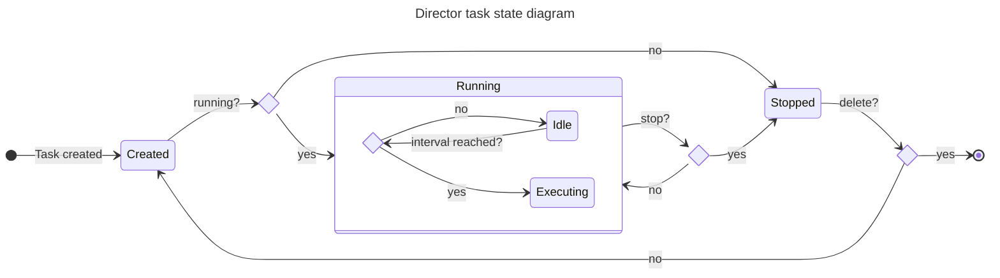

# Director

---

## Overview

The director service is a simple standalone service that execute a set of tasks periodically based on configuration. The tasks are defined in a JS file and the interval configuration is defined in JSON, both files must have the same name and be stored under `/public/director` folder of the assets manager.

Having created the JS and JSON files in assets manager, when the task is created in director it will request the the script to the assets manager for every execution. Once a task is created in director, it may be running or stopped, if it is running it will be executed periodically based on the interval configuration. The following state diagram shows the possible states of a task:



### Tasks

Director tasks are created based on the script stored in the assets manager. However, the tasks are actually JSON files with the following structure

```json
{
  "id": "taskId",
  "script": "scriptURL",
  "running": true,
  "config": {
    "agreementId": "agreementId",
  },
  "init": "UTC date",
  "end": "UTC date",
  "interval": 3600000
}
```

The `id` field identifies the task, whereas the `script` determines which JS script from the assets manager will be executed when `interval` is reached. The `init` field sets the initial date of the task and the `end` sets the date for its automatic deletion. The `config` field is an object that is passed to the API when creating the task, **it must not be mistaken with the JSON configuration file stored in the assets manager along with the JS script**. This JSON file determines the `init`, `end` and `interval` fields of the task.

### Scripts

Scripts are Node.JS modules that export a function called `main`. The function takes the configuration object as parameter and return a string with the result of the execution. The following example shows a simple script that returns the content of some JSON API.

```js
"use strict";

const axios = require("axios");

module.exports.main = (config) => {
    const requestURL = 'someURL';
    return JSON.stringify(await axios.get(requestURL));
}
```

## API

The director service exposes the following API:

| Method | Path | Description |
| --- | --- | --- |
| GET | /api/v1/tasks | Returns the list of tasks |
| GET | /api/v1/tasks/{id} | Returns the task |
| POST | /api/v1/tasks | Creates a new task |
| PUT | /api/v1/tasks/{id} | Updates the task |
| DELETE | /api/v1/tasks/{id} | Deletes the task |
| GET | /api/v1/tasks/{id}/status | Returns the task status |
| PUT | /api/v1/tasks/{id}/run | Runs the task |
