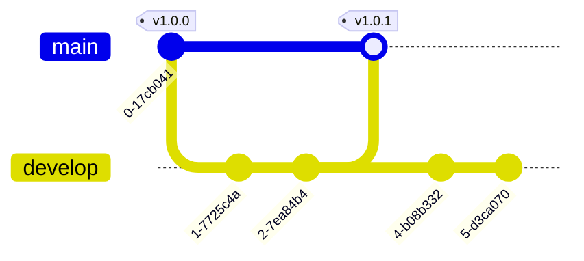

# GitFlow

---

When developing Governify services, we use an adapted version of the [GitFlow](https://nvie.com/posts/a-successful-git-branching-model/) branching model. This model is based on the use of two main branches: `main` and `develop`. The `main` branch is used to store the stable versions of the service, while the `develop` branch is used to store the latest version of the service, which is not necessarily stable.

Other branches may be created to develop new features or fix bugs. These branches are created from the `develop` branch and are merged back into it once the feature or bug fix is completed. There is not a convention of names for these branches, but it is recommended to use `feature/<feature-name>` or `bugfix/<bug-name>`.

## Commit Convention

When committing changes to the repository, it is recommended to follow the [Conventional Commits](https://www.conventionalcommits.org/en/v1.0.0/) convention. This convention allows to generate changelogs automatically and to determine the version of the service based on the changes introduced in the commit.
