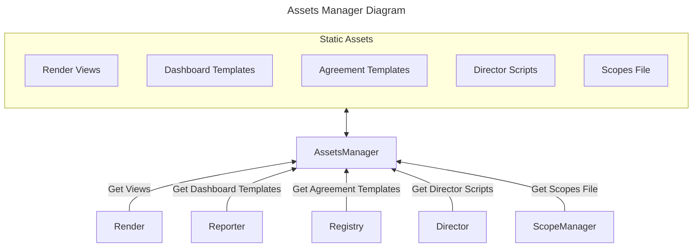

# Assets Manager

---

:::caution
Assets described here are common to Governify Ecosystem, static files may vary depending on the specific infrastructure.
:::

## Overview

The assets manager is the core component for serving all the files that need to be accessed via network. This includes the static files of the web applications, the templates for the agreements or the template for dashboards. The assets manager counts with a visual code editor on the web interface to edit the files directly from the browser, as described in the [Interface](#interface) section. However, all files are served through the API exposed by the express server integrated within the service. The following diagram shows the typical interactions between the services surrounding the assets manager.



### Static Assets

As shown in the diagram above, the Assets Manager serves a set of static assets that are used by the other services. Apart from the ones represented in the diagram, there are also some other files such as logs or the infrastructure.yaml file. The subsections below describe each of the static assets in detail.

#### Render Views

Currently Governify uses a generic implementation of the [MVC pattern](https://en.wikipedia.org/wiki/Model%E2%80%93view%E2%80%93controller) where the client components (views and controllers) are requested through network communication by the render service to the assets manager. This means that the render service, as its name states, is just in charge of rendering the views and controllers requested by the client.

Currently, the views and controllers are written in [AngularJS](https://angularjs.org/) and are served as static files by the assets manager. They are located under the `/public/renders` directory of the assets manager.

#### Dashboard Templates

The Dashboard templates are JSON and JS files requested by the Reporter to build the dashboards that are rendered by the dashboard service afterwards. The JSON file serves as a base for the dashboard and the JS file is used to define modifications and overlays to the base dashboard. The dashboard templates are located under the `/public/grafana-dashboards` directory of the assets manager.

#### Agreement Templates

The agreement templates are JSON files requested by the Registry to build the agreements and store them along with theis states. The agreement templates location may vary depending on the specific infrastructure, but they are usually located under one of the following directories:

- `/public/renders/tpa`
- `/public/renders/tpa/agreements`
- `/public/renders/renders/{agreement}/agreement.json`

#### Director Scripts

Director scripts are also templates used to create tasks executed periodically by the director service. They are files written in JS to which a JSON configuration is applied runtime. The director scripts are located under the `/public/director` directory of the assets manager.

Appart from the scripts located in the directory mentioned above, there are also scripts which are used to create and restore database backups. These scripts are located under the `/public/database` directory of the assets manager.

#### Scopes File

The scopes file is used by the scope manager to determine the scope of each agreement registered in Governify. Thus, it is a scope registry where all the scopes are stored in a JSON file. This file is located in the `/private/scope-manager` directory of the assets manager, which is password-protected when requesting it through the API.

#### Logs

The logs files generated by different services are stored inside the `/public/logs` directory of the assets manager. The Commons Library is the one which implements the logging system through [Winston](https://www.npmjs.com/package/winston) and stores the logs in the assets manager.

#### Infrastructure.yaml

As explained in the [Architecture section](/architecture/intro#service-discovery--registry) the infrastructure.yml is a file that contains the routes to each of the infrastructure services. It is used to implement service discovery and is located in the root of the `/public` directory of the assets manager. The following example shows the structure of the infrastructure.yaml file:

```yaml
internal:
  render:
    default: 'angular'
    angular: 'http://governify-render'
  assets:
    default: 'theia'
    theia: 'http://governify-assets-manager'
[...]
external:
  render: 
    default: 'angular'
    angular: 'https://ui{{dns.governify}}'
  assets:
    default: 'theia'
    theia: 'https://assets{{dns.governify}}'
[...]
dns:
  default: 'governify'
  governify: '$_[SERVICES_PREFIX]$_[DNS_SUFFIX]' # Environment vars
```

## API

The assets manager API is composed of the following endpoints:

| Method | Endpoint | Description |
| ------ | -------- | ----------- |
| GET    | `/api/v1/info/{path}?private_key={key}`| Returns the list of files located in the `{path}` |
| GET    | `/api/v1/public/{path}`| Returns the file located in the `{path}` |
| POST   | `/api/v1/public/{path}`| Creates the file sent in `req.files` at `{path}` |
| PUT    | `/api/v1/public/{path}`| Updates the file located in the `{path}` with body content |
| PATCH  | `/api/v1/public/{path}`| Updates the file located in the `{path}` with body content |
| GET    | `/api/v1/private/{path}?private_key={key}`| Returns the file located in the `{path}` |
| POST   | `/api/v1/private/{path}?private_key={key}`| Creates the file sent at `{path}` |
| PUT    | `/api/v1/private/{path}?private_key={key}`| Updates the file located in the `{path}` |
| PATCH  | `/api/v1/private/{path}?private_key={key}`| Updates the file located in the `{path}` |
| DELETE | `/api/v1/private/{path}?private_key={key}`| Deletes the file located in the `{path}` |

:::note
Note that when accessing the `/private` endpoints, the `private_key` query parameter is required. This parameter is the password used to protect the private files.
:::

## Interface

[Theia](https://theia-ide.org/) is an open source clound and desktop IDE platform for modifiying files and coding. The assets integrates a simple image of it to add the ability to modify it's files directly from the web browser. By accessing to the assets root URL/IP it will redirect to the Theia IDE. Use the credentials on .env to log in and you will be able to see all the public and private files in the folder hierarchy.

Theia cannot modify files if the docker volume is mapped to a folder instead of a docker volume. You can download the files directly from theia, create a volume, restart the service and drag in all the files directly to the files hierarchy.
