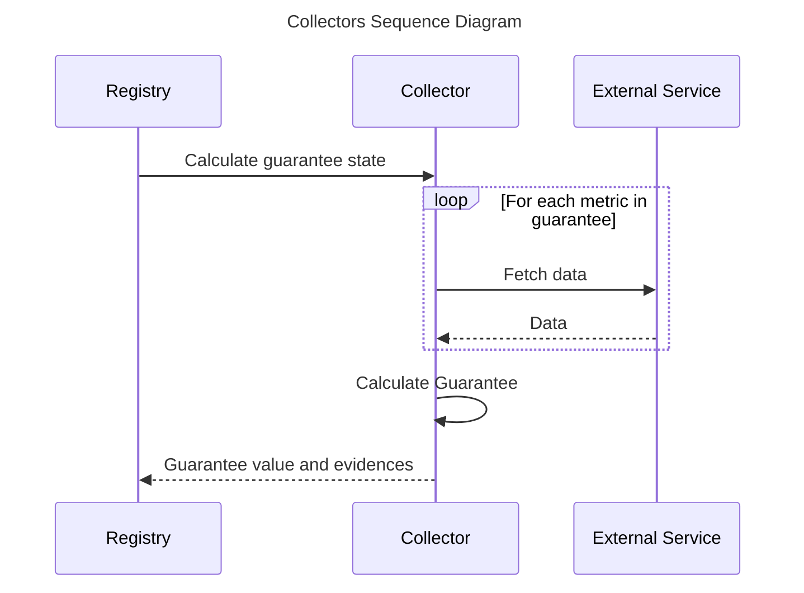

# Collectors

---

The Collector services are in charge of gathering the required data to compute the metrics and guarantees defined in the SLAs. The collectors are the ones who actually compute the values and evidences for the guarantees, and then send them to the Registry service to be stored. In general terms, this process can be summarized in the following diagram:

Depending on the use case, the required data may be fetched from different type of sources (REST APIs, GraphQL, SOAP...). In this context, Governify provide different types of collectors to fetch data from different sources:

* **[Collector Events](/development/services/collectors/collector-events):** Gather data from REST and GraphQL APIs of different platforms such as GitHub, Pivotal Tracker, Heroku, Travis CI, etc.

* **[Computer PPINOT](/development/services/collectors/computer-ppinot):** Gather data from PPINOT models.
