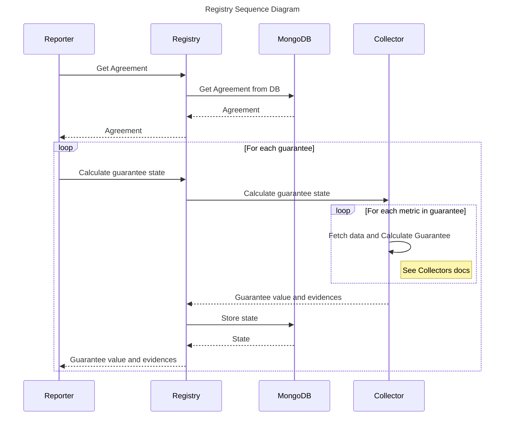
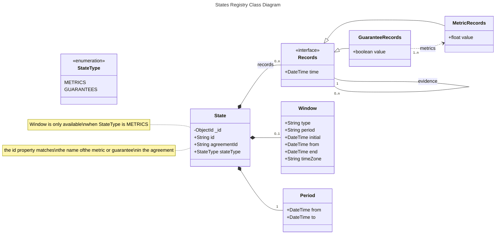

# Registry

---

:::info
The code for this service is publicly available at [GitHub](https://github.com/governify/registry)
:::

## Overview

Governify Registry is the service in charge of storing and managing the information related to the Service Level Agreements (SLAs) registered in the platform. The information is stored in two collections in a MongoDB database, as explained in the [Data Layer](#data-layer) section. The registry service manage the states which come as a result of the metric and guarantee computation, and the agreements themselves.

The above diagram shows a typical interactions between the services surrounding registry. As explained before, registry manages not only the agreements but also the states, result of metric and guarantee computations. The reporter service is the one who requests registry to calculate the states, then this call is directy passed to the collector service, which gathers the data and computes the guarantee value. Once the value is obtained, the state is stored in the database and returned to the reporter to build the dashboards afterwards.

## API

The Registry service counts with a REST API to interact with the service. The API is documented using OpenAPI and the documentation is exposed through the SwaggerUI at `/api/v6/docs` once deployed. The API is divided in two main sections, the Agreement Registry and the State Registry.

### Agreement Registry

The agreement registry is the part of the API in charge of managing the agreements. The following table shows the endpoints available for this section.

| Method | Endpoint | Description |
| ------ | -------- | ----------- |
| GET | `/api/v6/agreements` | Get all agreements |
| GET | `/api/v6/agreements/{agreementId}` | Get agreement by id |
| POST | `/api/v6/agreements` | Create agreement |
| DELETE | `/api/v6/agreements` | Delete all agreements |
| DELETE | `/api/v6/agreements/{agreementId}` | Delete agreement |

### State Registry

The state registry is the part of the API in charge of managing the states generated by the metric and guarantee computation. The following table shows the most relevant endpoints available for this section.

| Method | Endpoint | Description |
| ------ | -------- | ----------- |
| GET | `/api/v6/states` | Get all states |
| DELETE | `/api/v6/states` | Delete all states |
| GET | `/api/v6/states/{agreementId}` | Get all states for an agreement |
| GET | `/api/v6/states/{agreementId}/guarantees` | Get all guarantee states for an agreement |
| GET | `/api/v6/states/{agreementId}/guarantees/{guaranteeId}` | Get guarantee state for an agreement |
| POST | `/api/v6/states/{agreementId}/guarantees/{guaranteeId}/overrides` | Create guarantee state for an agreement |
| DELETE | `/api/v6/states/{agreementId}/guarantees/{guaranteeId}/overrides` | Delete guarantee state for an agreement |
| GET | `/api/v6/states/{agreementId}/netrics` | Get all metric states for an agreement |
| GET | `/api/v6/states/{agreementId}/metrics/{metricId}` | Get metric state for an agreement |
| POST | `/api/v6/states/{agreementId}/metrics/{metricId}` | Create metric state for an agreement |

## Data Layer

:::note
The Registry data layer is implemented using MongoDB, which is a NoSQL database. The class diagram(s) below show the structure of the data on a conceptual basis, the actual data is stored in JSON format, and thus, its structure is not fixed.
:::

The data layer is composed by two collections in a MongoDB database. The first one is the `agreements` collection, which stores the agreements themselves according to [iAgree 5.2 model](/references/iAgree.md). The second one is the `states` collection, which stores the states generated by the metric and guarantee computation. The following diagram shows the structure of the states collection.

