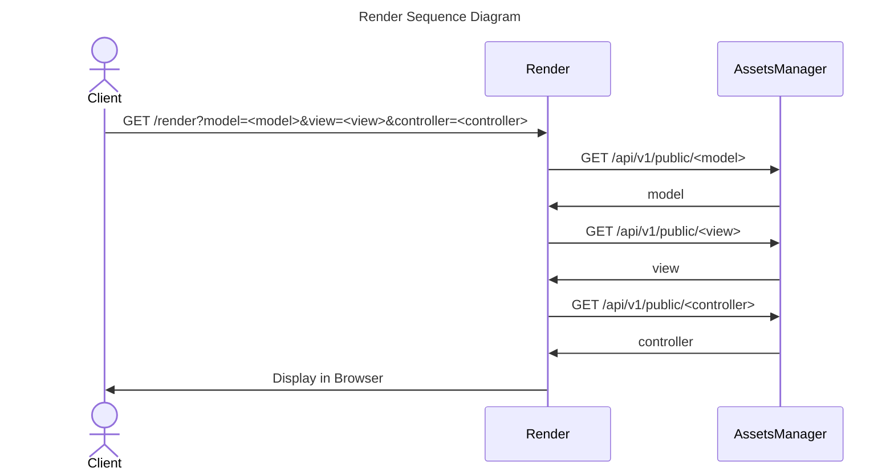

# Render

---

## Overview

Render, as its name suggests, is the service in charge of rendering the views that are displayed in the client browser. Thus, it is a generic service which unique task is to render HTML, CSS and JS files from external sources.

The render component follows the MVC design pattern and the model, views and controllers are retrieved from the assets manager. Currently, the service is able to render Angular.js Views and Controllers. To do so, it expects the URL to contain the path to the model, view and controller in the query, following this format:

```txt
<host>:<port>/render?model=<model>&view=<view>&controller=<controller>
```

The following diagram shows this behaviour:



### Models

Models are simple JSON files that are stored in the Assets Manager along views and controllers. The fields defined in the JSON are automatically available in the views using the Angular.js directives inside the `model` object. The following example shows a simple model:

```json
{
    "version": "1.0.0"
}
```

### Views

Render Views are written in Angular.js and stored under the `/public/renders` folder in the Assets Manager. The Render service integrates Bootstrap v3 or v5 (See [Configuration](#configuration) below) to provide a responsive, modern layout for the views. The views are common HTML files that allow the directives provided by Angular.js to be used. The following example shows a simple view:

```html
<html xmlns="http://www.w3.org/1999/xhtml">
    <head>
        <title>Example View</title>
    </head>
    <body>
        <div ng-controller="ExampleController">
            <h1>{{title}}</h1>
            <p>{{message}}</p>
            <p>{{model.version}}</p>
        </div>
    </body>
</html>
```

### Controllers

Controllers contain the business logic of the views. They are written in Javascript and stored under the `/public/renders` folder in the Assets Manager along models and views. The controllers are common JS files that allow the directives provided by Angular.js to be used. The fields defined under the `scope` object in the controller are automatically available in the views using the Angular.js directives. The following example shows a simple controller:

```js
$http({ // makes an HTTP request
    method: 'GET',
    url: 'someurl'
}).then(res => {
    $scope.title = res.data.title;
    $scope.message = res.data.message;
}).catch(err => {
    $scope.title = "Error!";
    $scope.message = "An error has occurred!";
    console.log(err);
});
```

## Configuration

The Render is configured through environment variables. The following table shows the available variables:

| Variable | Description | Default Value |
| -------- | ----------- | ------------- |
| PORT | Port where the service will be listening | 80 |
| LAYOUT | Layout to be used when rendering the view | bootstrap5.html |
| LOGIN_USER | User to be used when logging in | - |
| LOGIN_PASSWORD | Password to be used when logging in | - |
| DEFAULT_VIEW | Default view to be rendered when no view is specified in the URL | - |
| DEFAULT_CONTROLLER | Default controller to be rendered when no controller is specified in the URL | - |
| DEFAULT_MODEL | Default model to be rendered when no model is specified in the URL | - |
| GOV_INFRASTRUCTURE | URL of the Governify Infrastructure File for Service registry | - |
