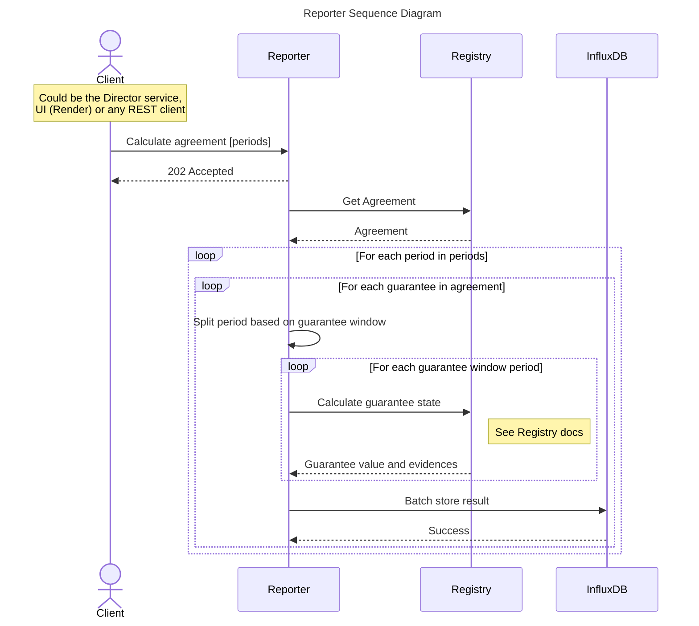
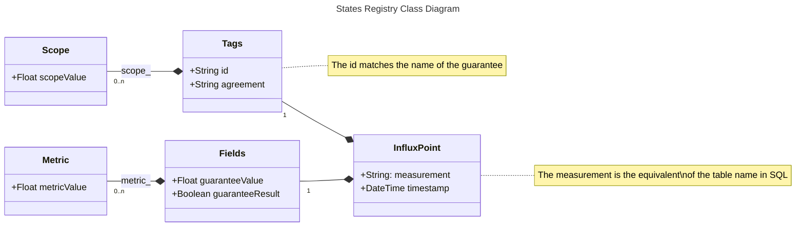

# Reporter

---

:::info
The code for this service is publicly available at [GitHub](https://github.com/governify/reporter)
:::

## Overview

As it name suggests, the reporter service is the one in charge of reporting the results (states) to the dashboards for visualization. To do that, it receives the states from the registry service and stores them in a time series database (InfluxDB), which is used by the dashboard service as a data source (see [Dashboard](/development/services/dashboard.md) for more information). The panels in the dashboards are generated by the reporter in JSON format, and rendered by the dashboard services afterwards. The sequence diagram below shows the interaction between the reporter and its surrounding services.

:::note
The interaction between Reporter and Dashboard is detailed in the [Dashboard](/development/services/dashboard.md) section.
:::

As shown in the diagram, before requesting the states to Registry, the periods sent for camputation are splitted based on the window specified in each of the guarantees of the agreement. Once obtained the states for a guarantee in a certain time window, the results are batch stored in influxDB following the model specified under the [Data Layer](#data-layer) section.

## API

The Reporter service counts with a REST API to interact with the service. The API is documented using OpenAPI 3.0 and the documentation is exposed through the SwaggerUI at `/api/v4/docs` once deployed. As with the registry, the API is divided in two main sections, the Dashboard Reporter and the Contracts Reporter.

### Contracts Reporter

The contracts reporter is the part of the API in charge of managing the agreement computation and storing the results in the time series database. The following table shows the relevant endpoints available for this section.

| Method | Endpoint | Description |
| ------ | -------- | ----------- |
| POST | `/api/v4/contracts/{contractId}/createHistory` | Calculate the full agreement from the initial time |
| POST | `/api/v4/contracts/{contractId}/createPointFromPeriods`| Calculate the agreement for a given list of periods |

:::note
In the table above, the agreements are referred to as "contracts" as it is the name used in the code.
:::

### Dashboard Reporter

The dashboard reporter is in charge of generating the JSON panels for the dashboard service, which will make use of the endpoints in the table below to retrieve the data to be displayed.

| Method | Endpoint | Description |
| ------ | -------- | ----------- |
| GET | `/api/v4/dashboards/{agreementId}/{dashboardId}` | Get the dashboard for a specific agreement |
| GET | `/api/v4/dashboards/evolution/{agreementId}` | Get the evolution dashboard for a specific agreement |

## Data Layer

The reporter service stores the states in a time series database ([InfluxDB](https://www.influxdata.com/)). Influx points depends on a value and a timestamp so it can be placed in a time series chart. However, other attributes may be added to the point, providing it with additional information. The following class diagram shows the conceptual model of one influx point stored by the reporter service:

:::note
The Metric and Scope classes are actually inserted as keys inside Fields and Tags, using the prefixes `metric_` and `scope_` respectively, so the keys are formatted as `metric_<METRIC>` or `scope_<SCOPE>`. They are shown as separate classes for clarity purposes.
:::
