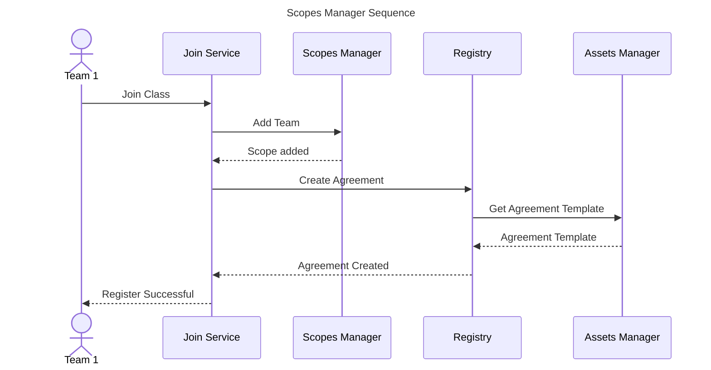

# Scopes Manager

---

## Overview

The scope manager is a service that allows to manage different scopes when auditing Agile teams. It is mainly used in [Bluejay Infrastructure](https://docs.bluejay.governify.io) due to the necessity of managing agreements for different teams within a same class or organization.

When using the scopes manager, an agreement template is created for one class or organization. Then, different teams within that class or organization register towards the scopes manager to get their own agreement based on the template. This interaction is shown in the following diagram:



The join service is a component that helps registering the team and creating the agreement. All requests could be made manually using a REST client. Agreements are not automatically created upon registration since some team may want to be registered but do not be audited until a certain moment, thus, the agreement is created when the team is ready to be audited.

### Info.yml

Scopes are typically generated based on a GitHub project. To do that, there must exist an `info.yml` file in the root of the GitHub repository. This file contains the information needed to generate the scopes, so the scopes manager can validate it and generate the scopes through its API. The file is structured as follows:

```yaml
project:
  name: 'string'
  owner: 'string'
  teamId: 'string'
  identities:
    heroku: 'url'
    pivotal: 'url'
  members:
    member:
      name: 'string'
      surname: 'string' 
      githubUsername: 'string'
```

### Scopes File

The scopes file is stored in the private directory of the [Assets Manager service](/development/services/assets-manager). It is a JSON file that contains the different scopes that can be used in the agreements. The file is structured as follows:

```json
{
    "<scope-name>": [{
        "classId": "class01",
        "identities": [],
        "credentials": [],
        "projects": [{
            "name": "projectName01",
            "projectId": "project01",
            "owner": "owner01",
            "identities": [{
                "source": "github",
                "repository": "repo01",
                "repoOwner": "owner01"
            }],
            "credentials": [{
                "source": "github",
                "apiKey": "githubToken"
            }],
            "members": [{
                "memberId": 1,
                "identities": [{
                    "source": "github",
                    "username": "githubName01"
                }],
                "credentials": []
            }]
        }]
    }]
}
```

#### Class

A class is a group of teams that share the same agreement template. The class is identified by its `classId`. The `identities`, `credentials` and `projects` fields are used to define the scopes for the class.

#### Identities

The identities define the scope of each project or the class. Thus, Identities can be defined at class level or project level. The concrete definition of an identity depends on its `source`, since it may require more fields. The following table shows the different sources and the fields required:

| Source | Fields | Description |
| ------ | ------ | ----------- |
| github | repository, repoOwner | The repository of the project and the owner of the repository. |
| pivotal| projectId | The id of the project. |
| heroku | projectId | The name of the application. |
| travis | - | No fields required. |
| codeclimate | - | No fields required. |

#### Credentials

The credentials are needed in case the identity requires authentication. The credentials are defined in the same way as the identities, the required fields to define credentials are `source` and `apikey.`

#### Projects

Projects are a lower level scope. They are identified through a `projectId` and a `name`. The `owner` field is used to define the owner of the project. The `identities` and `credentials` fields are used to define the scope of the project. The `members` field is used to define the members of the project. The members are defined in the same way as the projects, but they are identified by a `memberId` instead of a `projectId`.

Members also contain identities which identify their username or account in the different sources. Credentials may be defined at member level, but since they all belong to the same team, they are usually defined at project level.

## API

The Scopes Manager service exposes a REST API that allows to manage the scopes file. The following table shows the different endpoints:

| Method | Endpoint | Description |
| ------ | -------- | ----------- |
| GET | `/api/v1/scopes/<scope-name>/courses` | Gets all the classes or organizations |
| GET | `/api/v1/scopes/<scope-name>/{courseId}` | Gets the class or organization with the given id |
| GET | `/api/v1/scopes/<scope-name>/{courseId}/projects` | Gets all the projects of the class or organization with the given id |
| GET | `/api/v1/scopes/<scope-name>/{courseId}/{projectId}` | Gets the project with the given id of the class or organization with the given id |
| GET | `/api/v1/scopes/<scope-name>/{courseId}/{projectId}/members` | Gets all the members of the project with the given id of the class or organization with the given id |
| GET | `/api/v1/scopes/<scope-name>/{courseId}/{projectId}/{memberId}` | Gets the member with the given id of the project with the given id of the class or organization with the given id |
| POST | `/api/v1/scopes/<scope-name>/generate` | Generate scopes from a given GitHub list of projects |
| POST | `/api/v1/scopes/<scope-name>/check` | Check the info.yaml from a given GitHub list of projects |
